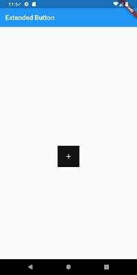
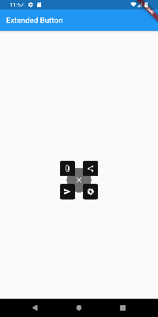

## About
A Flutter package to create a beautiful extended button which can expand and shrink whenever the user clicks on the button. 

[](https://pub.dev/packages/extended_button)

#### Shrunk state




#### Expanded state



## Usage

Add `extended_button`as a dependency in your pubspec.yaml
```YAML
 dependencies:
  flutter:
    sdk: flutter
  extended_button: 0.0.1
```
Run `flutter pub get` in the terminal and import `import 'package:extended_button/extended_button.dart'`

## Example

```dart
void main() => runApp(MaterialApp(
  home: Scaffold(
    appBar: AppBar(
      title: Text("Extended Button Demo"),
    ),
    body: Container(
      alignment: Alignment.center,
      child: ExtendedButton(
        size: 100,
        bottomLeftIcon: Icons.shopping_cart,
        bottomRightIcon: Icons.print,
        topLeftIcon: Icons.photo,
        topRightIcon: Icons.print,
        onClickBottomLeft: () {
          print("Shopping Cart Clicked");
        },
        onClickBottomRight:  () {
          print("Print Icon Clicked");
        },
        onClickTopLeft:  () {
          print("Photo Icon Clicked");
        },
        onClickTopRight:  () {
          print("Print Icon Clicked");
        },
      ),
    ),
  ),
));

```

## TODO
- Add more button
- Add widget test

## Feature Requests and Issues
Please file feature requests and bugs at the [issue tracker](https://github.com/AyushBherwani1998/extended_button/issues)

## Contributing
We would love to see you contribute to extended_button. Feel free to send a pull request to add new buttons to the package.
